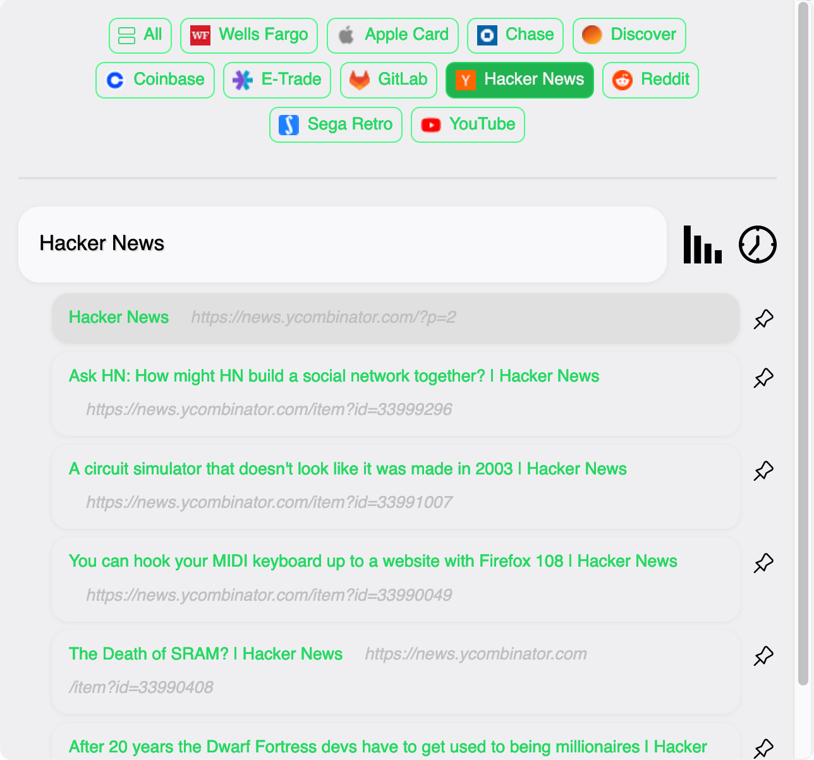

# favorites-folder

A Firefox extension for displaying the Bookmarks Toolbar items with their most recent and most visited history items. Written in JavaScript.

## Installation

This extension can be installed through its [Firefox add-on page](https://addons.mozilla.org/en-US/firefox/addon/favorites-folder/) or from the [Chrome Web Store](https://chrome.google.com/webstore/detail/favorites-folder/geldjnbnanmkbgijhopibgohaaipamdm).

## Guide

After the extension is installed, a Favorites Folder icon is added to your toolbar. Click this icon to open Favorites Folder.

Each Bookmarks Toolbar is shown in a list. By default, the extension shows the most visited page for the domain of each item along with the five most recently visited pages. Pages can be pinned so that they are always displayed at the top of the list.

Clicking the bar graph icon lets you change the number of most visited pages to show; clicking the clock icon lets you change the number of recently visited pages to show. Either can be set to zero to hide the list entirely. The extension remembers the settings for each site.

## Acknowledgments

Uses [heart](https://www.svgrepo.com/svg/14970/heart), [compass](https://www.svgrepo.com/svg/9960/compass), [bar chart](https://www.svgrepo.com/svg/106921/bar-chart), [clock](https://www.svgrepo.com/svg/32993/clock), and [pin](https://www.svgrepo.com/svg/309873/pin) vectors from [SVG Repo](https://www.svgrepo.com/).

## Authors

- J.C. Fields <jcfields@jcfields.dev>

## License

- [ISC license](https://opensource.org/licenses/ISC)
